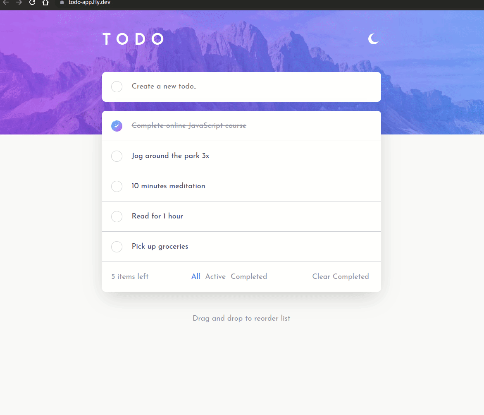
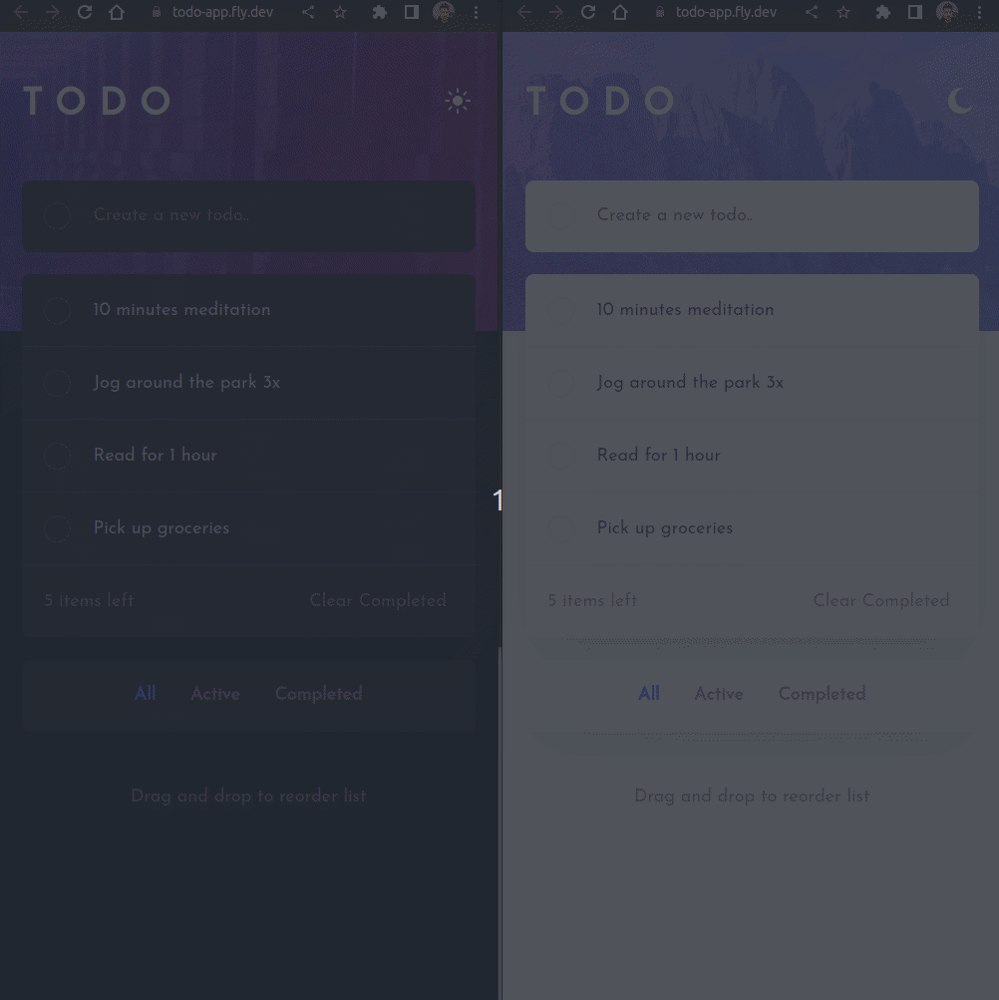
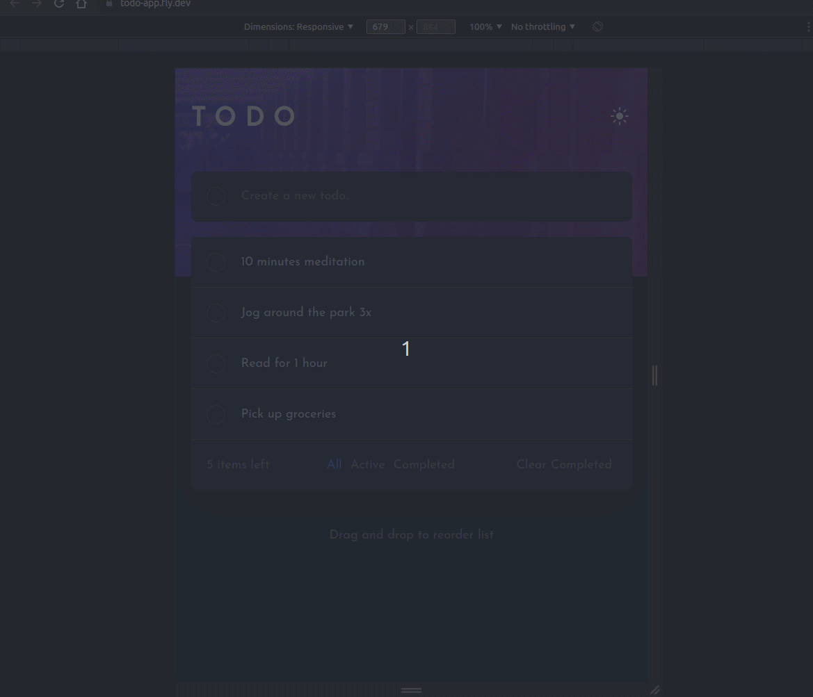

# TodoApp

This is a solution to the [Todo app challenge on Frontend Mentor](https://www.frontendmentor.io/challenges/todo-app-Su1_KokOW).

## Table of contents

* [Overview](#overview)
  * [The challenge](#the-challenge)
  * [Screenshot](#screenshot)
  * [Links](#links)
* [My process](#my-process)
  * [Built with](#built-with)
  * [Useful resources](#useful-resources)
* [Author](#author)

## Overview

### The challenge

Users should be able to:

* View the optimal layout for the app depending on their device's screen size
* See hover states for all interactive elements on the page
* Add new todos to the list
* Mark todos as complete
* Delete todos from the list
* Filter by all/active/complete todos
* Clear all completed todos
* Toggle light and dark mode
* **Bonus**: Drag and drop to reorder items on the list

### Screenshot

#### Broadcast

#### Responsiveness

### Links

* [Solution URL](https://github.com/williamthome/todo_app)
* [Live Site URL](https://todo-app.fly.dev/)

## My process

### Built with

* Semantic HTML5 markup
* CSS custom properties
* Flexbox
* CSS Grid
* Mobile-first workflow

### Useful resources

* Official website: https://www.phoenixframework.org/
* Guides: https://hexdocs.pm/phoenix/overview.html
* Docs: https://hexdocs.pm/phoenix
* Forum: https://elixirforum.com/c/phoenix-forum
* Source: https://github.com/phoenixframework/phoenix

## Author

* LinkedIn - [William Fank Thomé](https://www.linkedin.com/in/williamthome/)
* Github - [@williamthome](https://github.com/williamthome)
* Frontend Mentor - [@williamthome](https://www.frontendmentor.io/profile/williamthome)
* Twitter - [@willegp88](https://www.twitter.com/willegp88)

## Development

### Phoenix

To start your Phoenix server:

  * Install dependencies with `mix deps.get`
  * Create and migrate your database with `mix ecto.setup`
  * Start Phoenix endpoint with `mix phx.server` or inside IEx with `iex -S mix phx.server`

Now you can visit [`localhost:4000`](http://localhost:4000) from your browser.
